+++
id: building-lejos
status: Draft
summary: PizzaFactory/Camino で leJOS のビルドを行います。
author: Masaki Muranaka <monaka@pizzafactory.jp>
categories: PizzaFactory/Camino
tags: lejos, EV3, PizzaFactory/Camino, Java
feedback link: https://github.com/PizzaFactory/lezione/issues
analytics account: UA-135551325-1
+++

# Building leJOS on PizzaFactory/Camino

## 事前条件

PizzaFactory/Camino の dashboard は開けている状態から始めます。

## ワークスペースの作成

### メニュー選択

ウインドウ左側、上下中央付近にある「➕ Create Workspace」という項目を押します。

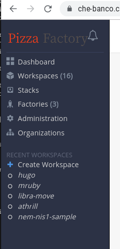

### レシピ選択

devfile.yaml を含むレシピの一覧が出てきます。スクロールして「leJOS」をクリックして選択ください。

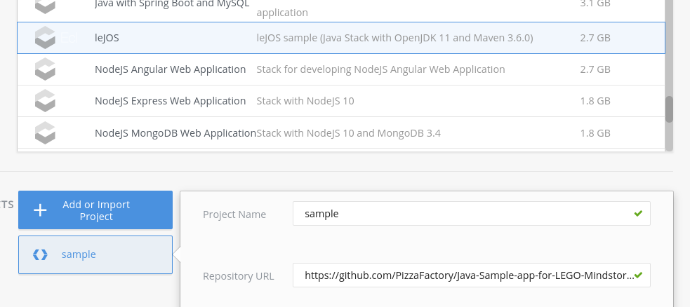

### ワークスペースのオープン

画面を右上にある「CREATE & OPEN」を押してください。黒い画面に切り替わります。すぐには反応しないかもしれませんが、数秒待ってみてください。

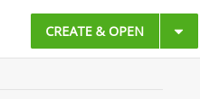

## ワークスペースのデプロイ待ち

現在何を行っているか、ログが出てきます。

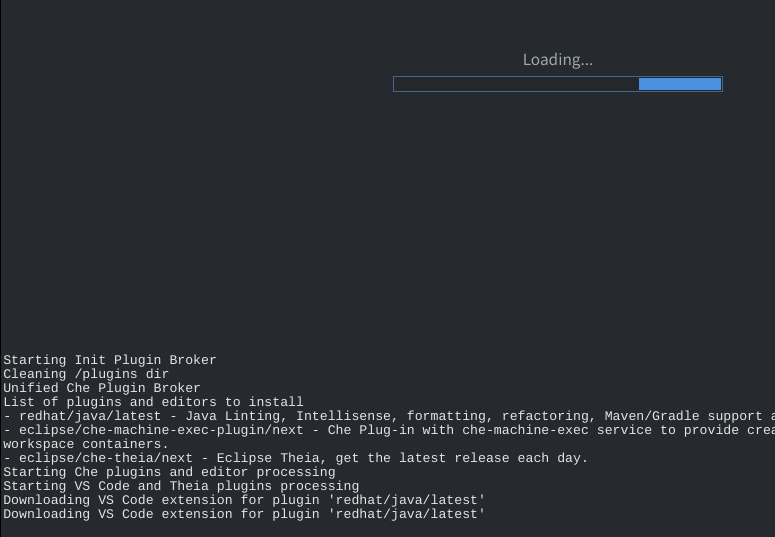

早ければ 1 分程度で、これから使うワークスペースのデプロイが終わります。

Negative
: 多数のユーザがサーバクラスタ上で作業している場合、裏で新しいVMインスタンスが立ち上げる処理が入ることがあり、その際には10分程度を要する場合もあります。

デプロイが終了すると、画面がリロードされ、Microsoft Visual Studio Code (VS Code) とよく似た画面が出てきます。

Positive
: 本稿では余談となりますが、Che7 の標準エディタ Theia は、VS Code が使っているのと同じエディタ・エンジン (Monaco) を使っています。なので、基本的な使用感はほぼ同じです。

## サンプル用プロジェクトの clone 待ち

エディタ画面が表示されると同時に、サンプル用のプロジェクトが GitHub から clone されてきます。この処理は自動で走り、進み具合はリボンで通知してきます。

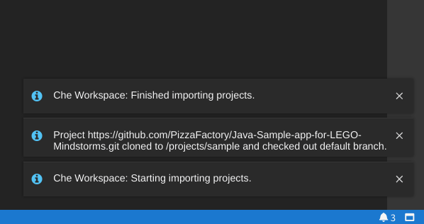

`Che Workspace: Finished importing projects` というメッセージが出たのを確認して、ビルドの作業に入ります。

## ビルドの実行

メニューの `Terminal` から `Run Task...` を選びます。

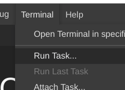

Positive
: 本稿では余談となりますが、`Run Task...` の上にある`Open Terminal in spec...` を選ぶと、ターミナルタブが開き Bash シェルが使えます。

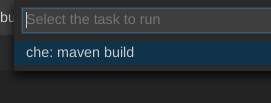

どのタスクを実行するかを問われるので、`che: maven build` を選びます。

環境によっては、コンソールの出力と Problems タブとのリンクを行うかどうか確認される場合もあります。(現行の PizzaFactory/Camino では出ます)

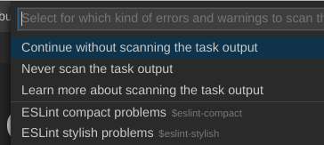

ここでは `Continue without scanning the task output` を選びます。

すぐには反応しない場合があり不安になるかもしれませんが、数秒程度で、タスクが始まったことを示すリボンが表示されます。

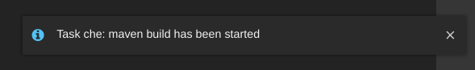

上記リボンと前後して、ビルドログを表示するタブが開き、ビルドが進んでいきます。

## 成果物のダウンロード

ビルドの結果として得られる jar 形式ファイルは、クラウド上のワークスペースにあります。
お手元の LEGO Mindstorms へインストールするには、お手元の端末にダウンロードする必要があります。

### Explorer ビューの利用

エディタ画面左上にある、書類が重なっている絵柄のアイコンボタンを押し、Explorer ビューを表示します。

`sample` をクリックして開き、`target` を開きます。

`LEGOMind-1.0-SNAPSHOT.jar` というファイルが見つかるはずです。

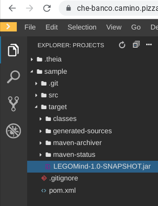

ここを右クリックしてコンテストメニューを開くと、その中にダウンロードの項目あります。

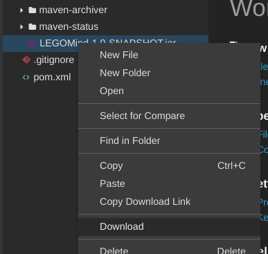
